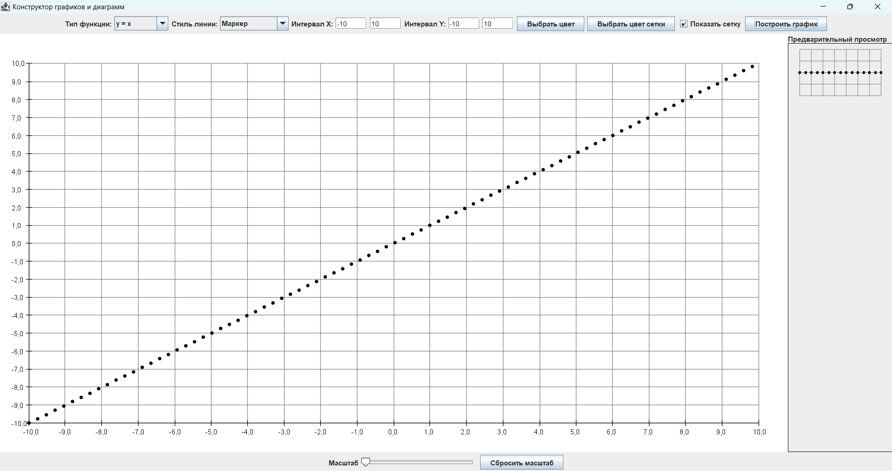

# Конструктор графиков и диаграмм

Этот проект представляет собой графический конструктор для построения различных математических функций. Пользователь может выбирать тип функции, стиль линии, цвет графика, настраивать интервалы осей, добавлять сетку, изменять масштаб и просматривать графики в интерактивном интерфейсе.

## Функциональные возможности

- **Выбор функции**: Поддерживаются различные типы функций, такие как линейная, квадратичная, синус, косинус и другие.
- **Настройка стиля линии**: Можно выбрать стиль линии, включая сплошную линию, маркеры и комбинированный стиль.
- **Настройка цвета**: Выбор цвета линии и сетки для графика.
- **Интервалы осей**: Возможность задать минимальные и максимальные значения для осей \( X \) и \( Y \).
- **Сетка**: Возможность включить или отключить отображение сетки на графике.
- **Масштабирование**: Слайдер для увеличения и уменьшения масштаба графика с кнопкой для сброса масштаба.
- **Предварительный просмотр**: Окно предварительного просмотра выбранных параметров графика.

## Структура проекта

### Основные компоненты

- **MainFrame**: Главный класс окна приложения, содержащий интерфейс пользователя.
- **ControlPanel**: Панель управления для выбора типа функции, настройки стиля линии, выбора цветов, задания интервалов и включения сетки.
- **GraphPanel**: Панель, отвечающая за отрисовку графика на основе выбранных параметров.
- **ScalePanel**: Панель с слайдером для изменения масштаба графика и кнопкой сброса.

### Классы и функции

- **GraphPanel**:
    - `updateSettings`: Обновляет параметры графика, такие как тип функции, стиль линии, цвет, интервалы осей и сетка.
    - `updateScale`: Меняет масштаб графика в зависимости от значения слайдера.
    - `drawFunction`: Рисует выбранную функцию на основе текущих настроек.
    - `drawGrid`: Отображает сетку на графике, если она включена.
    - `drawAxes`: Рисует оси графика и отображает отметки по осям.
    - `getFunction`: Возвращает функцию для выбранного типа графика.

## Запуск проекта

### Требования
- **Java**: Требуется установленная Java (версии 8 и выше).

### Инструкции по запуску

1. Клонируйте репозиторий или скачайте проект:
   ```bash
   git clone https://github.com/your-username/graph-constructor.git
   ```

2. Перейдите в папку проекта:
   ```bash
   cd graph-constructor
   ```

3. Запустите проект:
    - Если вы используете IDE, например IntelliJ IDEA, откройте проект и запустите `MainFrame`.
    - Для запуска из командной строки выполните:
      ```bash
      javac src/MainFrame.java
      java -cp src MainFrame
      ```

## Использование

1. **Выбор функции**: В выпадающем меню выберите тип функции, которую хотите построить.
2. **Настройка стиля линии и цвета**: Выберите стиль линии (например, сплошная или с маркерами) и настройте цвет линии и сетки.
3. **Задание интервалов**: Введите значения минимального и максимального интервалов для осей \( X \) и \( Y \).
4. **Построение графика**: Нажмите кнопку "Построить график" для отображения графика с заданными параметрами.
5. **Масштабирование**: Используйте слайдер для увеличения или уменьшения масштаба графика. Кнопка "Сбросить масштаб" возвращает масштаб к исходным настройкам.

## Пример работы



## Примечания

- Слайдер масштаба всегда возвращает график к начальным диапазонам при минимальном значении слайдера.
- Поддержка математических функций включает стандартные функции, такие как \( y = x \), \( y = x^2 \), \( y = \sin(x) \), \( y = \cos(x) \), и другие.
- Все изменения графика отображаются в реальном времени при нажатии кнопки "Построить график".

## Дополнительная информация

### Поддерживаемые функции

В приложении поддерживаются следующие функции:
- Линейная: y = x
- Квадратичная: y = x^2 
- Синус: y = sin(x) 
- Косинус: y = cos(x)
- Логарифм: y = ln(x) 
- Экспоненциальная: y = e^x 
- Кубическая: y = x^3 
- Модуль: y = |x| 
- Тангенс: y = tan(x) 
- Котангенс: y = cot(x) 
- Обратная пропорциональность: y = 1/x, y = -1/x
---
